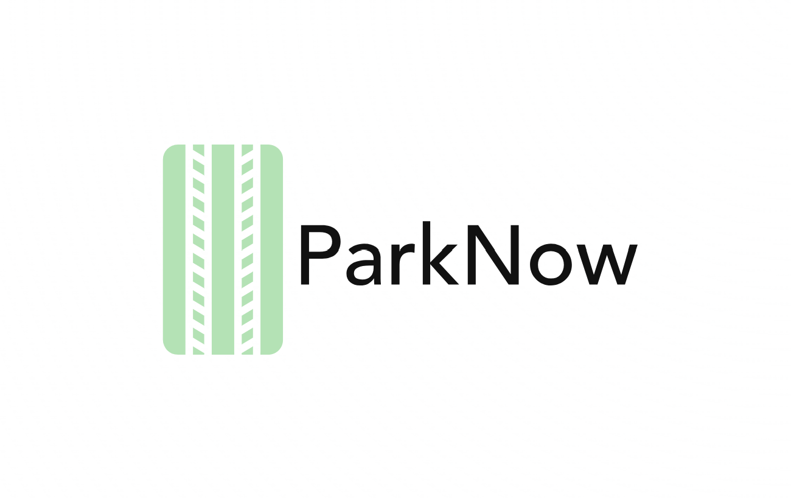

# Welcome to ParkNow ! 

ParkNow is a web application designed to streamline parking management for vehicle owners in Singapore. It simplifies the process of locating, booking, and paying for parking spaces, helping to reduce the time and fuel wasted in searching for parking spots. With features like real-time parking availability, reservations, and navigation assistance, ParkNow aims to improve urban mobility and reduce congestion.

## Technology Stack

- ASP.Net Core Blazor (Front End and Back End)

- MudBlazor (Component Library)

- Leaflet (For Maps)

- MSSql (For Database Storage)

- Docker (For Easier Deployment)

- Nginx (Reverse Proxy to proxy requests to Blazor)

## Features

- **User Account Management**: 
  - Register and log in using Google or email.
  - Manage user profiles and update account information.
  - Securely reset passwords.

- **Vehicle Details Management**: 
  - Add, update, and manage vehicle information.
  - Support for different vehicle types including private, commercial, and electric vehicles.

- **Parking Space Locator**: 
  - Search for available parking spaces based on location, carpark number, or postal code.
  - Real-time updates on parking availability and rates.

- **Navigation Assistance**: 
  - Get turn-by-turn directions to the selected parking spot using Google Maps integration.
  - Real-time location tracking and route updates.

- **Reservation System**: 
  - Book parking spots in advance to secure availability.
  - Modify or cancel reservations as needed within a specified time frame.

- **Carpark Payment**: 
  - Make secure payments for parking reservations through integrated payment gateways.
  - Apply promo codes or discounts during the payment process.
  - View transaction history for past parking sessions.

- **Parking History**: 
  - View detailed records of past parking sessions, including location, time, and cost.
  - Filter history by carpark name, date range, or frequency of visits.

- **In-app Guide**: 
  - Step-by-step instructions for new users to get started with the application.
  - Provides guidance on managing accounts, booking parking, and making payments.

## Environment Setup
### 1. Install dotnet 8.0
After installation, check by entering "dotnet" into cmd, u should see some help functions

### 2. Install docker
After installation, check by entering "docker" into cmd, u should see some help functions

### 3. Run in your cmd the following
```
docker pull mcr.microsoft.com/mssql/server:2022-latest
```

### 4. Pull the latest parknow repo with 
```
git clone https://github.com/MetaSlave/ParkNow
```

### 5. Add a new file called "appsettings.json" in the main dir

### 6. inside the file, paste the following
```
{
  "ConnectionStrings": {
    "DefaultConnection": "Data Source=localhost,1433;User ID=sa;Password=123456a@;Database=ParkNow;MultipleActiveResultSets=true;TrustServerCertificate=true"
  },
  "Logging": {
    "LogLevel": {
      "Default": "Information",
      "Microsoft.AspNetCore": "Warning"
    }
  },
  "AllowedHosts": "*"
}
```

### 7. Run the following in cmd
```
docker run -e "ACCEPT_EULA=Y" -e "MSSQL_SA_PASSWORD=123456a@" -p 1433:1433 --name sa -d mcr.microsoft.com/mssql/server:2022-latest
```

### 8. Go to your cli in the main parknow dir, and run 
```
dotnet run
```

### 9. Visit "http://localhost:5121/" and make sure the site is up

### 11. Run the following command to install the pyodbc module (optional)
```
pip install pyodbc
```

### 12. Install ODBC Driver 18 for SQL Server online
https://learn.microsoft.com/en-us/sql/connect/odbc/download-odbc-driver-for-sql-server?view=sql-server-ver16

### 12. Run the following command in the main dir
```
python populateCarpark.py
```

# BookingService Documentation

The `BookingService` class provides methods to manage booking operations within the ParkNow system. It includes CRUD operations for bookings as well as additional utility functions like price calculation.

## CRUD Operations

### CreateBooking

#### Without Voucher
```csharp
Task<bool> CreateBooking(Booking booking)
```
Creates a new booking in the system.

**Parameters:**
- `booking` (Booking): The booking entity to be created

**Returns:**
- `Task<bool>`: True if creation is successful, false otherwise

#### With Voucher
```csharp
Task<bool> CreateBooking(Booking booking, Voucher voucher)
```
Creates a new booking with an applied voucher discount.

**Parameters:**
- `booking` (Booking): The booking entity to be created
- `voucher` (Voucher): The voucher to be applied to the booking

**Returns:**
- `Task<bool>`: True if creation is successful, false otherwise

### GetUserBookings
```csharp
Task<List<Booking>> GetUserBookings(string username)
```
Retrieves all active (non-deleted) bookings for a specific user.

**Parameters:**
- `username` (string): The username to search bookings for

**Returns:**
- `Task<List<Booking>>`: List of bookings associated with the user, or empty list if none found

### GetBooking
```csharp
Task<Booking> GetBooking(int bookingId)
```
Retrieves a specific booking by its ID.

**Parameters:**
- `bookingId` (int): The ID of the booking to retrieve

**Returns:**
- `Task<Booking>`: The requested booking entity, or null if not found

### UpdateBooking
```csharp
Task<bool> UpdateBooking(Booking booking)
```
Updates an existing booking's information (start time, end time, cost, and status).

**Parameters:**
- `booking` (Booking): The booking entity with updated information

**Returns:**
- `Task<bool>`: True if update is successful, false otherwise

### DeleteBooking
```csharp
Task<bool> DeleteBooking(int bookingId)
```
Marks a booking as deleted in the system (soft delete).

**Parameters:**
- `bookingId` (int): The ID of the booking to mark as deleted

**Returns:**
- `Task<bool>`: True if deletion is successful, false otherwise

## Utility Functions

### CalculatePrice
```csharp
decimal CalculatePrice(DateTime start, DateTime end, Carpark carpark)
```
Calculates the parking fee for a specific time range at a given carpark.

**Parameters:**
- `start` (DateTime): Start time of the parking period
- `end` (DateTime): End time of the parking period
- `carpark` (Carpark): The carpark entity to calculate price for

**Returns:**
- `decimal`: Calculated price for the parking duration, or 0 if parking is not available for the specified time range
